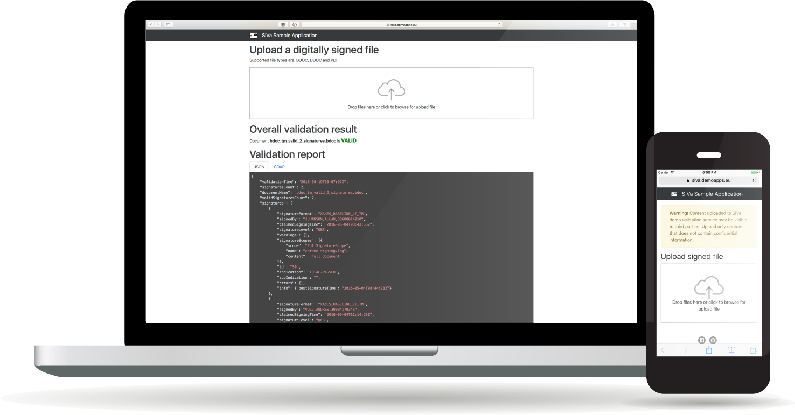

# Signature Verification Service Demo Application

[](https://github.com/open-eid/siva/actions/workflows/siva-verify.yml)
[](https://raw.githubusercontent.com/open-eid/SiVa/develop/LICENSE.md)

SiVa demo is digital signature validation web interface that uses SiVa APIs to validate following file types:

* Estonian DDOC containers
* Estonian BDOC containers with TimeMark and TimeStamp signatures
* Estonian ASiC-S containers with time stamp tokens
* ETSI standard based ASiC-E and ASiC-S containers
* ETSI standard based XAdES, CAdES and PAdES signatures
* ETSI standard based XAdES signatures with datafiles in hashcode form

## Requirements

These are minimum requirements to build and develop SiVa demo project:

* **git** - to easily download and update code. You can [download git here](https://git-scm.com/)
* **Java JDK 17** - to compile and run SiVa demo
* **IDE** - to develop SiVa. We recommend to use [JetBrains IntelliJ](https://www.jetbrains.com/idea/)
* Optionally You can also install **Maven** but it is not needed because SiVa project uses Maven wrapper to install maven
* **SiVa parent project** - Can be found [here](https://github.com/open-eid/SiVa)

## How to build

### Using Maven Wrapper

Recommended way of building this project is using [Maven Wrapper](https://github.com/takari/maven-wrapper).
Run the following command:

```bash
./mvnw clean install
```

### For Docker

Alternatively, run the following command to build Docker image:

```bash
./mvnw clean spring-boot:build-image
```


## How-to run

### With docker

Follow the Docker instructions for [SiVa webapp](https://github.com/open-eid/SiVa) to run both apps at the same time.

### Without docker

SiVa project by default compiles an executable JAR file that can be run after successfully building the project by issuing below command:

```bash
java -jar target/siva-demo-application-X.X.X.jar
```

Another option is to run it directly with:

```
./mvnw spring-boot:run
```

### Accessing the application

After the demo application is built and running You can point Your browser to URL: <http://localhost:9000>.

- SiVa Demo Application UI allows to upload 1 file at a time and with maximum file size 11 MiB.



## WAR and Tomcat setup for legacy systems

> **NOTE**: Each SiVa service **must** be deployed to separate instance of Tomcat to avoid Java JAR library version
> conflicts.

To build the WAR file use helper script with all the correct Maven parameters.

```bash
./war-build.sh
```

Copy built WAR file into Tomcat `webapps` directory and start the servlet container. NB! X.X.X denotes the version you are running.

```bash
cp target/siva-demo-application-X.X.X.war apache-tomcat-7.0.70/webapps
./apache-tomcat-7.0.77/bin/catalina.sh run
```

### How-to set WAR deployed SiVa `application.properties`

SiVa override properties can be set using `application.properties` file. The file can locate anywhare in the host system.
To make properties file accessible for SiVa you need to create or edit `setenv.sh` placed inside `bin` directory.

Contents of the `setenv.sh` file should look like:

```bash
export CATALINA_OPTS="-Dspring.config.location=file:/path/to/application.properties"
```

## How-to run tests

Unit test are integral part of the SiVa code base. The tests are automatically executed every
time the application is built. The build will fail if any of the tests fail.

To execute the tests from command line after application is built use:

```bash
./mvnw verify
```

## Open source software used to build SiVa demo

Full list of open source Java libraries used to build SiVa can be found in our
[Open Source Software used page](OSS_USED.md)

## Documentation

Read [SiVa documentation](http://open-eid.github.io/SiVa/)
